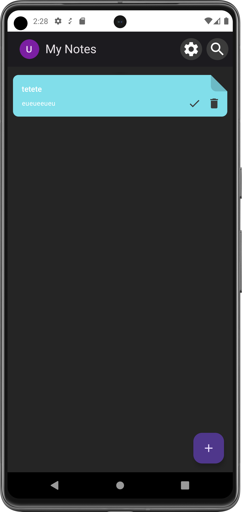
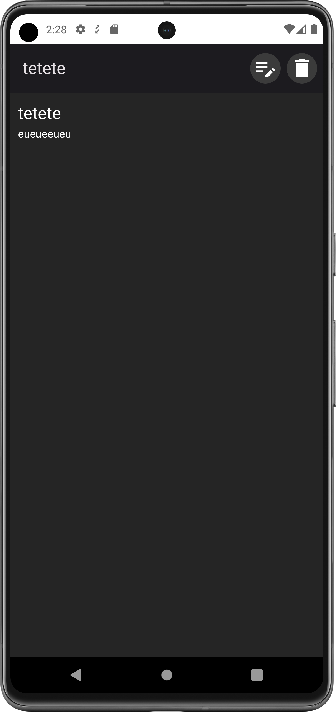
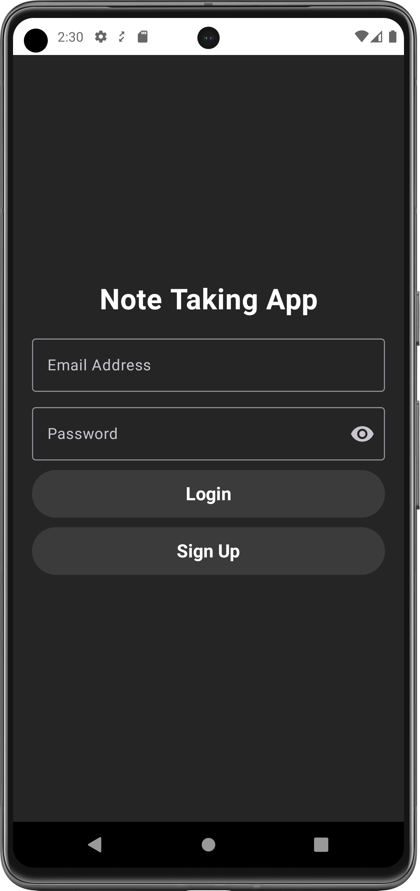
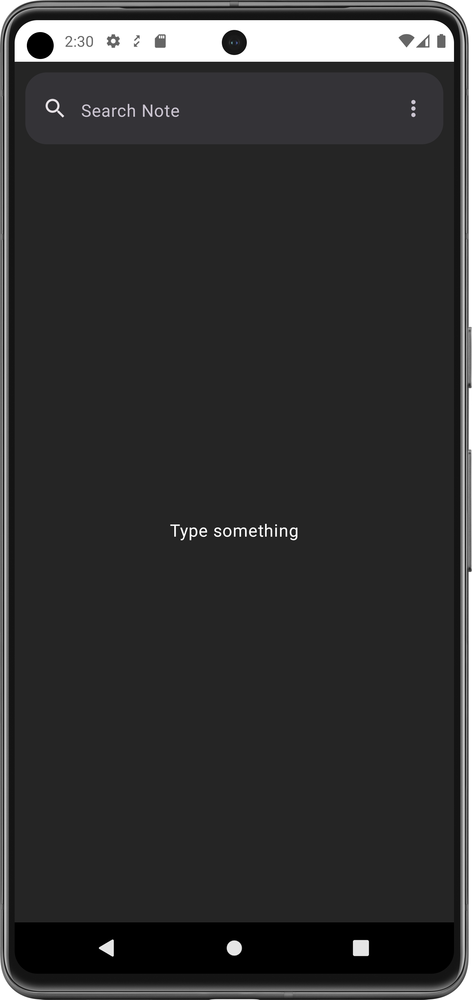
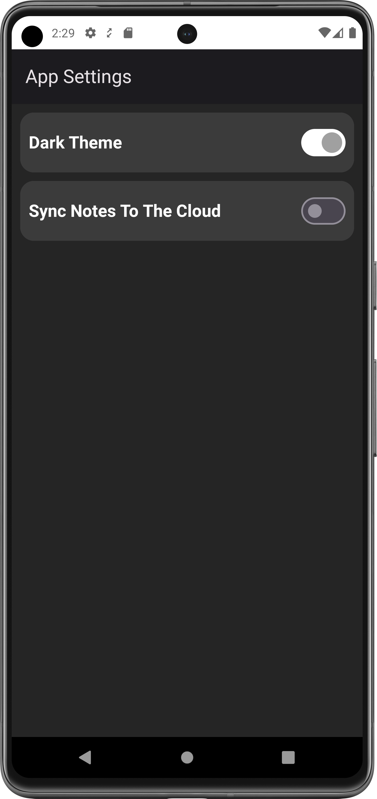
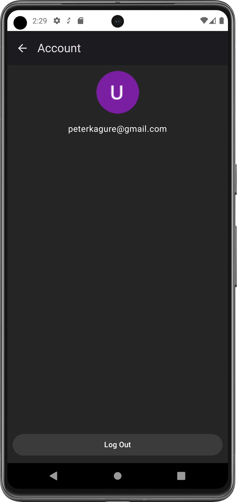

# Note Taking App

This is a simple note Taking app that allows CRUD operations on your notes

The notes are also stored on firebase firestore for remote storage capabilities to enable
users to retrieve notes across devices.

The app has email/password authentication which uses Firebase Auth for simplicity instead of making a 
custom backend for it.

The goal of this project is show how sync data between local cache and remote database.

For the remote Database, I am using firebase FireStore and the local cache is backed by a room database.

The syncing strategy is not perfect and is still a WIP 

## Setbacks

Firebase firestore does not allow delete operations of documents from an android client so delete operations
only work for the room database. To delete documents remotely I would need a cloud function which is
too much for this simple app

## Libraries Used

1. Jetpack Compose(Material 3)
2. Room Database
3. Firebase Authentication
4. Firebase FireStore
5. Work Manager for background syncing 
6. Koin For Dependency Injection

## Screenshots of The App

  

  

